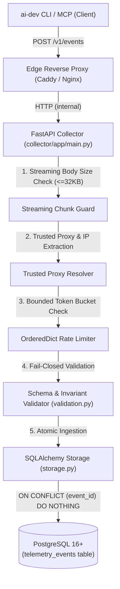

# Community Telemetry Collector Specification & Architecture

This document defines the contract, schema validation rules, storage architecture, and operational guidelines for the production Community Telemetry Collector service (`collector/`) receiving events from `ai-dev`.

---

## 1. Collector Architecture



### Key Modules
- **`collector/app/main.py`**: FastAPI application exposing `POST /v1/events`, `GET /health` (liveness), and `GET /ready` (readiness).
- **`collector/app/config.py`**: Configuration with fail-fast validation (`ENVIRONMENT=production` requires PostgreSQL).
- **`collector/app/validation.py`**: Fail-closed schema and invariant validation (UUIDv4, UTC hour format, PEP 440 semver, exact key allowlists, token consistency, origin/event_type invariants).
- **`collector/app/models.py`**: SQLAlchemy declarative model (`TelemetryEvent`). Stores only allowlisted fields.
- **`collector/app/storage.py`**: Database session and atomic conflict handling.
- **`collector/app/rate_limit.py`**: Hard-bounded token bucket rate limiter with LRU eviction (`len(_buckets) <= MAX_ENTRIES`).
- **`collector/app/retention.py`**: 90-day retention cleanup utility based strictly on `received_at`.
- **`collector/alembic/`**: Version-controlled database schema migrations.

---

## 2. HTTP Endpoints Contract

### `POST /v1/events`
Receives and stores a single telemetry event.

- **Method**: `POST`
- **Path**: `/v1/events`
- **Request Headers**:
  - `Content-Type: application/json`
  - `User-Agent: ai-dev/<version>`
  - `X-Schema-Version: 1`
- **Request Body**: JSON object matching `schema_version = 1` (maximum `32,768 bytes`). Streamed with early abort if size is exceeded.
- **Response Status Codes**:
  - `202 Accepted`: Payload accepted and stored (`{"status": "accepted", "duplicate": false}`).
  - `200 OK`: Payload accepted as duplicate (`{"status": "accepted", "duplicate": true}`). No new record is inserted.
  - `400 Bad Request`: Validation failure or malformed JSON (`{"status": "rejected", "error": "validation_failed"}`).
  - `413 Content Too Large`: Payload exceeds 32 KB (`{"status": "rejected", "error": "payload_too_large"}`).
  - `415 Unsupported Media Type`: Content-Type is not `application/json` (`{"status": "rejected", "error": "unsupported_media_type"}`).
  - `429 Too Many Requests`: Client exceeded rate limit (`{"status": "rejected", "error": "rate_limited"}`). Includes `Retry-After` header.

### `GET /health`
Liveness probe: confirms the collector application process is healthy and running.

- **Method**: `GET`
- **Path**: `/health`
- **Response**: `200 OK` (`{"status": "ok", "schema_version": 1}`)

### `GET /ready`
Readiness probe: confirms the collector can successfully query the backing database.

- **Method**: `GET`
- **Path**: `/ready`
- **Response**:
  - `200 OK`: `{"status": "ready", "database": "connected"}`
  - `503 Service Unavailable`: `{"status": "degraded", "error": "database_unavailable"}`

---

## 3. Strict Fail-Closed Ingestion & Validation Rules

The collector operates with zero client trust:

1. **Streaming Body Size Limit**: Request body is read incrementally via streaming chunks. If total bytes exceed 32,768 bytes, the connection is immediately aborted with `413 Content Too Large` without full JSON buffer allocation.
2. **Trusted Proxy Model**:
   - Default: `TRUST_PROXY_HEADERS=false`. The client IP is derived from the direct peer address (`request.client.host`).
   - If `TRUST_PROXY_HEADERS=true`: `X-Forwarded-For` is only parsed if the direct peer IP belongs to `TRUSTED_PROXY_IPS` / `TRUSTED_PROXY_NETWORKS`. Otherwise, spoofed headers are ignored.
3. **Hard-Bounded Rate Limiter**:
   - Stored in an `OrderedDict` with LRU eviction.
   - Enforces an invariant that `len(_buckets) <= MAX_ENTRIES` (default 10,000) under any adversarial key flooding attack.
4. **No Schema Coercion**: Types must match strictly (e.g. `true` is never coerced to `1`, `"120"` is never coerced to `120`).
5. **Strict Top-Level Key Allowlist**:
   - `basic`: Exactly the 11 keys (`schema_version`, `event_id`, `event_type`, `timestamp_hour`, `os_family`, `python_version`, `ai_dev_version`, `command_name`, `command_category`, `command_outcome`, `duration_bucket`).
   - `research`: Only the approved 33 keys. Any unknown key causes immediate `400 Bad Request`.
6. **Format & Identity Constraints**:
   - `schema_version`: Must strictly equal integer `1`.
   - `event_id`: Valid UUIDv4 string.
   - `timestamp_hour`: Must strictly match UTC hour format `YYYY-MM-DDTHH:00:00Z`.
   - `python_version`: Major.minor string `^3\.\d+$`.
   - `ai_dev_version`: PEP 440 semver string starting with digits, length 1–32.
7. **Event Type Invariants**:
   - `command_run`: Allowed levels `basic` or `research`. When `research`, `origin` must strictly be `null`.
   - `provider_usage`: Allowed level `research` only. `origin` must be one of `{"mcp", "import", "unknown"}`. `command_name` must be `"mcp"` or `"telemetry"`, and `command_category` must be `"telemetry"`.
8. **Numeric Bounds & Token Consistency**:
   - Finite floats only: Reject `NaN`, `Infinity`, `-Infinity`.
   - `duration_seconds`: $0.0 \le x \le 604800.0$.
   - Tokens: $0 \le \text{tokens} \le 100,000,000$.
   - Token Consistency: `cached_input_tokens <= input_tokens` and `total_tokens >= input_tokens + output_tokens`.
   - Ratios: $0.0 \le \text{ratio} \le 1.0$.

---

## 4. Database Schema & Migrations

Database migrations are managed by **Alembic** (`collector/alembic/`).

### Applying Migrations
```bash
# Run latest database migrations
python -m alembic -c collector/alembic.ini upgrade head

# Verify current revision
python -m alembic -c collector/alembic.ini current
```

### Table: `telemetry_events`
```sql
CREATE TABLE telemetry_events (
    event_id VARCHAR(36) PRIMARY KEY,
    received_at TIMESTAMP WITH TIME ZONE NOT NULL,
    schema_version INTEGER NOT NULL,
    telemetry_level VARCHAR(16) NOT NULL,
    event_type VARCHAR(32) NOT NULL,
    timestamp_hour VARCHAR(32) NOT NULL,
    os_family VARCHAR(16) NOT NULL,
    python_version VARCHAR(16) NOT NULL,
    ai_dev_version VARCHAR(32) NOT NULL,
    command_name VARCHAR(32) NOT NULL,
    command_category VARCHAR(32) NOT NULL,
    command_outcome VARCHAR(16) NOT NULL,
    reason_code VARCHAR(64),
    duration_bucket VARCHAR(32) NOT NULL,
    duration_seconds DOUBLE PRECISION,
    cache_hit BOOLEAN,
    ai_client VARCHAR(32),
    model VARCHAR(64),
    task_kind VARCHAR(32),
    validation_result VARCHAR(16),
    task_outcome VARCHAR(16),
    repo_files_bucket VARCHAR(32),
    repo_size_bucket VARCHAR(32),
    language_families TEXT,
    retrieval_reason_code VARCHAR(64),
    selection_reason_codes TEXT,
    origin VARCHAR(16),
    context_candidate_tokens INTEGER,
    context_delivered_tokens INTEGER,
    context_budget INTEGER,
    input_tokens INTEGER,
    cached_input_tokens INTEGER,
    output_tokens INTEGER,
    reasoning_tokens INTEGER,
    total_tokens INTEGER,
    tool_call_count INTEGER,
    files_considered INTEGER,
    files_selected INTEGER,
    files_omitted INTEGER,
    cache_hit_ratio DOUBLE PRECISION,
    semantic_cache_reuse DOUBLE PRECISION,
    local_overhead_seconds DOUBLE PRECISION,
    total_wall_time_seconds DOUBLE PRECISION
);

CREATE INDEX ix_telemetry_events_command_name ON telemetry_events (command_name);
CREATE INDEX ix_telemetry_events_event_type ON telemetry_events (event_type);
CREATE INDEX ix_telemetry_events_received_at ON telemetry_events (received_at);
CREATE INDEX ix_telemetry_events_telemetry_level ON telemetry_events (telemetry_level);
CREATE INDEX ix_telemetry_events_timestamp_hour ON telemetry_events (timestamp_hour);
```

---

## 5. Deduplication & Idempotency

The collector relies on `event_id` as the primary key constraint:
- When retried network deliveries arrive, the database constraint detects the duplicate atomically.
- The duplicate event is safely acknowledged with `200 OK` (`{"status": "accepted", "duplicate": true}`).
- The client receives confirmation of delivery, clears its local spool, and stops retrying.

---

## 6. Retention Policy (90 Days)

Raw events older than 90 days are deleted using `collector/app/retention.py` based strictly on server `received_at`:

```bash
# Dry run: preview expired events without deleting
python -m collector.app.retention --days 90 --dry-run

# Purge expired records
python -m collector.app.retention --days 90
```

Client-provided timestamps (`timestamp_hour`) are **never** trusted for retention calculations.

---

## 7. Analytical SQL Queries

Below are read-only analytical queries for deriving community insights without compromising privacy:

### 1. Daily Event Volume by Telemetry Level
```sql
SELECT
    timestamp_hour,
    telemetry_level,
    event_type,
    COUNT(*) AS event_count
FROM telemetry_events
GROUP BY 1, 2, 3
ORDER BY 1 DESC, 2;
```

### 2. Command Execution Latency (P50, P90, P95)
```sql
SELECT
    command_name,
    COUNT(*) AS run_count,
    ROUND(PERCENTILE_CONT(0.50) WITHIN GROUP (ORDER BY duration_seconds)::NUMERIC, 3) AS p50_seconds,
    ROUND(PERCENTILE_CONT(0.90) WITHIN GROUP (ORDER BY duration_seconds)::NUMERIC, 3) AS p90_seconds,
    ROUND(PERCENTILE_CONT(0.95) WITHIN GROUP (ORDER BY duration_seconds)::NUMERIC, 3) AS p95_seconds
FROM telemetry_events
WHERE duration_seconds IS NOT NULL
GROUP BY command_name
HAVING COUNT(*) >= 10
ORDER BY run_count DESC;
```

### 3. Token Consumption & Cache Efficiency
```sql
SELECT
    model,
    COUNT(*) AS session_count,
    SUM(input_tokens) AS total_input_tokens,
    SUM(output_tokens) AS total_output_tokens,
    SUM(cached_input_tokens) AS total_cached_tokens,
    ROUND(
        (SUM(cached_input_tokens)::NUMERIC / NULLIF(SUM(input_tokens), 0)::NUMERIC) * 100, 2
    ) AS cache_savings_pct
FROM telemetry_events
WHERE model IS NOT NULL AND input_tokens IS NOT NULL
GROUP BY model
ORDER BY session_count DESC;
```

### 4. Provider Usage Breakdown (MCP vs CLI Import)
```sql
SELECT
    origin,
    ai_client,
    model,
    COUNT(*) AS events_count,
    SUM(total_tokens) AS total_tokens_used
FROM telemetry_events
WHERE event_type = 'provider_usage'
GROUP BY origin, ai_client, model
ORDER BY events_count DESC;
```

---

## 8. Further Reading
- [Deployment Guide](community-telemetry-deployment.md) for Caddy / Nginx reverse proxy configurations, access log discards, and production setup.
- [Community Telemetry Specification](community-telemetry.md) for client privacy rules and telemetry level details.
