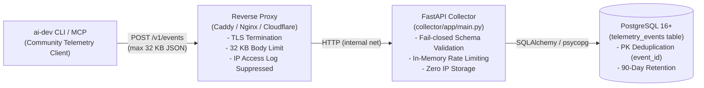

# Community Telemetry Collector Deployment Guide

This guide describes how to deploy, configure, and operate the production backend collector for **ai-dev Community Telemetry** (`collector/`).

---

## Architecture Overview



### Core Tenets
1. **Privacy-Preserving**: No client IP addresses are ever stored in the database.
2. **Reverse Proxy Log Suppression**: Web server access logs for `/v1/events` must have client IPs discarded or disabled.
3. **Fail-Closed Validation**: Payloads are strictly checked against schema invariants before database insertion.
4. **Idempotent Ingestion**: Duplicate submissions of the same `event_id` are acknowledged with `200 OK` (`duplicate: true`) without redundant database writes.
5. **90-Day Retention**: Raw events are purged after 90 days via an automated retention task.

---

## Deployment Options

### Comparison

| Dimension | Option A: Managed PaaS (Render / Fly.io) | Option B: Self-Hosted VPS (Docker Compose + Caddy) |
|---|---|---|
| **Simplicity & Ops** | High (Managed buildpacks, zero OS maintenance) | Medium (Requires Docker, OS updates, systemd) |
| **Privacy & Log Control** | Medium (Platform access logs may log IPs unless stripped) | **Maximum** (Full control over Caddy/Nginx log discards) |
| **Cost** | ~$7–$15/mo (Free tier available for low volume) | **~$4–$6/mo** (Fixed cost e.g., Hetzner / OVH) |
| **Database Management** | Managed Postgres (Automated backups, HA) | Containerized Postgres or Managed DB |
| **Recommendation** | Ideal for zero-ops, prototyping, and rapid setup | **Recommended for Production** (Guarantees strict log privacy) |

---

## Option B: Self-Hosted VPS with Docker Compose & Caddy (Recommended)

This setup provides absolute control over server logs, ensuring zero IP tracking at the edge.

### 1. Prerequisites
- Linux VPS (Ubuntu 22.04 / 24.04 or Debian 12).
- Ports 80 and 443 open.
- Domain name pointed to the server's public IP (e.g. `telemetry.ai-dev.example.com`).
- Docker and Docker Compose installed.

### 2. Environment Configuration
On your server, create an application directory:
```bash
mkdir -p /opt/ai-dev-collector
cd /opt/ai-dev-collector
```

Copy the `collector/` directory to `/opt/ai-dev-collector`.

Create `/opt/ai-dev-collector/.env`:
```env
DATABASE_URL=postgresql://collector_user:STRONG_PASSWORD_HERE@db:5432/telemetry_db
RATE_LIMIT_PER_MINUTE=60
RETENTION_DAYS=90
MAX_PAYLOAD_BYTES=32768
ENVIRONMENT=production
```

### 3. Caddy Reverse Proxy Configuration

Caddy provides automatic HTTPS (Let's Encrypt / ZeroSSL) and flexible logging directives. Configure Caddy to explicitly discard access logs for telemetry endpoints:

```caddy
# /etc/caddy/Caddyfile

telemetry.ai-dev.example.com {
    encode gzip zstd

    # Enforce request body size limit at edge
    request_body {
        max_size 32KiB
    }

    # Security headers
    header {
        X-Content-Type-Options nosniff
        X-Frame-Options DENY
        Referrer-Policy no-referrer
        Strict-Transport-Security "max-age=31536000; includeSubDomains; preload"
        -Server
    }

    # PRIVACY CRITICAL: Disable access logging for telemetry ingestion
    @telemetry path /v1/events
    handle @telemetry {
        log {
            output discard
        }
        reverse_proxy collector:8000 {
            transport http {
                read_timeout 10s
                write_timeout 10s
            }
        }
    }

    # Health check endpoint (can be monitored by UptimeRobot / BetterStack)
    @health path /health
    handle @health {
        reverse_proxy collector:8000
    }

    # Reject all other paths
    handle {
        respond "Not Found" 404
    }
}
```

### 4. Alternative: Nginx Reverse Proxy Configuration

If using Nginx, configure the virtual host as follows:

```nginx
# /etc/nginx/sites-available/telemetry.ai-dev.example.com

server {
    listen 443 ssl http2;
    server_name telemetry.ai-dev.example.com;

    ssl_certificate /etc/letsencrypt/live/telemetry.ai-dev.example.com/fullchain.pem;
    ssl_certificate_key /etc/letsencrypt/live/telemetry.ai-dev.example.com/privkey.pem;
    ssl_protocols TLSv1.2 TLSv1.3;

    # Security headers
    add_header X-Content-Type-Options nosniff always;
    add_header X-Frame-Options DENY always;
    add_header Referrer-Policy no-referrer always;

    # Limit client request body size to 32 KB
    client_max_body_size 32k;
    client_body_buffer_size 32k;

    # PRIVACY CRITICAL: Completely disable access log for /v1/events
    location = /v1/events {
        access_log off;
        proxy_pass http://127.0.0.1:8000;
        proxy_http_version 1.1;
        proxy_set_header Host $host;
        proxy_set_header X-Real-IP $remote_addr;
        proxy_set_header X-Forwarded-For $proxy_add_x_forwarded_for;
        proxy_set_header X-Forwarded-Proto $scheme;
        proxy_read_timeout 10s;
        proxy_send_timeout 10s;
    }

    # Health check endpoint
    location = /health {
        access_log /var/log/nginx/health_access.log;
        proxy_pass http://127.0.0.1:8000;
        proxy_http_version 1.1;
    }

    # Default deny
    location / {
        return 404;
    }
}
```

### 5. Start the Stack

```bash
docker compose up -d
```

Verify service status:
```bash
docker compose ps
curl -i https://telemetry.ai-dev.example.com/health
```

Expected response:
```json
HTTP/2 200
content-type: application/json
x-content-type-options: nosniff

{"status":"ok","schema_version":1}
```

---

## Option A: Managed PaaS Deployment (Render / Fly.io)

### Deploying to Render
1. **New Web Service**: Connect your GitHub repository.
2. **Root Directory**: `collector`.
3. **Environment**: `Docker` (uses `collector/Dockerfile`).
4. **Environment Variables**:
   - `DATABASE_URL`: Set to connection string from a Managed PostgreSQL instance.
   - `RATE_LIMIT_PER_MINUTE`: `60`
   - `RETENTION_DAYS`: `90`
5. **Health Check Path**: `/health`.

### Deploying to Fly.io
1. Change directory to `collector/`:
   ```bash
   cd collector
   fly launch --no-deploy
   ```
2. Attach a Fly Postgres database:
   ```bash
   fly postgres attach <postgres-app-name>
   ```
3. Set secrets:
   ```bash
   fly secrets set RATE_LIMIT_PER_MINUTE=60 RETENTION_DAYS=90
   ```
4. Deploy:
   ```bash
   fly deploy
   ```

---

## Automated Retention Policy (90 Days)

The collector includes a retention cleanup module (`collector/app/retention.py`).

### Option 1: Host Cron Job
Add a daily cron job on the host machine to run the retention script inside the container:

```bash
# /etc/cron.d/ai-dev-telemetry-retention
0 3 * * * root docker exec ai-dev-collector python -m app.retention --days 90 >> /var/log/telemetry-retention.log 2>&1
```

### Option 2: Systemd Timer
Create a systemd service:
```ini
# /etc/systemd/system/telemetry-retention.service
[Unit]
Description=ai-dev Community Telemetry 90-Day Retention Cleanup
After=docker.service

[Service]
Type=oneshot
WorkingDirectory=/opt/ai-dev-collector
ExecStart=/usr/bin/docker compose exec -T collector python -m app.retention --days 90
```

And timer:
```ini
# /etc/systemd/system/telemetry-retention.timer
[Unit]
Description=Run ai-dev Community Telemetry retention cleanup daily

[Timer]
OnCalendar=*-*-* 03:30:00
Persistent=true

[Install]
WantedBy=timers.target
```

Enable and activate:
```bash
systemctl daemon-reload
systemctl enable --now telemetry-retention.timer
```

---

## Operational Verification & Checklist

Before pointing production clients to this endpoint, verify each item:

- [ ] **Health Check**: `GET /health` returns `200 OK` with `{"status": "ok", "schema_version": 1}`.
- [ ] **TLS Enforcement**: Non-HTTPS requests are redirected to HTTPS.
- [ ] **Access Log Privacy**: Confirmed reverse proxy does NOT write client IP addresses for requests to `/v1/events`.
- [ ] **Payload Size Limit**: A request exceeding 32 KB returns `413 Content Too Large`.
- [ ] **Rate Limiting**: Sending >60 requests in a burst returns `429 Too Many Requests`.
- [ ] **Fail-Closed Validation**: Sending an invalid schema or unexpected field returns `400 Bad Request`.
- [ ] **Deduplication**: Submitting the same `event_id` twice returns `200 OK` with `{"duplicate": true}` on the second call without creating a second record.
- [ ] **Retention Job**: `python -m app.retention --dry-run` successfully connects and reports expired count.
