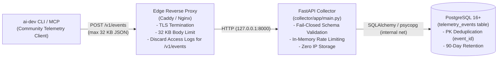

# Community Telemetry Collector Deployment Guide

This guide describes how to deploy, configure, and operate the backend collector for **ai-dev Community Telemetry** (`collector/`).

---

## Architecture Overview



### Core Tenets
1. **Privacy-Preserving**: No client IP addresses are ever stored in the database.
2. **Reverse Proxy Log Discard**: Web server access logs for `/v1/events` must have client IPs discarded or logging completely disabled at the edge reverse proxy.
3. **Strict Trusted Proxying**: The collector ignores `X-Forwarded-For` unless `TRUST_PROXY_HEADERS=true` and the direct peer matches `TRUSTED_PROXY_IPS`.
4. **Streaming Chunk Body Limit**: Payloads exceeding 32 KB are aborted immediately without full memory buffering.
5. **Fail-Closed Validation**: Payloads are strictly checked against schema allowlist invariants before database insertion.
6. **Idempotent Ingestion**: Duplicate submissions of the same `event_id` are acknowledged with `200 OK` (`duplicate: true`) without redundant database writes.
7. **Versioned Migrations**: Database schema changes are managed explicitly via Alembic (`collector/alembic/`).
8. **90-Day Retention**: Raw events are purged after 90 days via an automated retention task based strictly on server `received_at`.

---

## Local Development vs. Production Environments

| Component | Local Development (`collector/docker-compose.yml`) | Production (`deploy/gce/` Reference) |
|---|---|---|
| **Purpose** | Local testing, debugging, CI | Public ingestion endpoint |
| **Compose File** | `collector/docker-compose.yml` | `docker-compose.production.yml` (template in `deploy/gce/`) |
| **Database Exposure** | Binds `127.0.0.1:5432:5432` for local tools | **Isolated** on internal container network; port 5432 is **never** published |
| **Credentials** | Development fallback passwords allowed | Strong random `POSTGRES_PASSWORD` in `.env` outside Git |
| **Reverse Proxy** | Direct connection to port 8000 | Caddy / Nginx with HTTPS and access log discards |
| **Trust Proxy Headers** | `false` | `true` (strictly paired with `TRUSTED_PROXY_IPS`) |
| **Safety Warning** | **NEVER use `collector/docker-compose.yml` in production** | Fully isolated production topology |

---

## Section A: Local Development

For local testing and development, `collector/docker-compose.yml` provides a self-contained environment with PostgreSQL and automated migrations.

```bash
# Start local development collector and PostgreSQL
docker compose -f collector/docker-compose.yml up -d --build

# Check status
docker compose -f collector/docker-compose.yml ps

# Test liveness probe
curl http://127.0.0.1:8000/health

# Run test ingestion locally
python -m ai_dev_tools.cli telemetry sharing enable basic --endpoint http://127.0.0.1:8000/v1/events
python -m ai_dev_tools.cli capabilities --json
python -m ai_dev_tools.cli telemetry sharing flush --json
```

---

## Section B: Production Reference Architecture (GCE / Linux VPS)

This is the recommended production architecture, providing full control over edge logs and ensuring strict privacy guarantees.

Production templates are provided in `deploy/gce/`:
- `deploy/gce/.env.example`
- `deploy/gce/docker-compose.production.example.yml`
- `deploy/gce/Caddyfile.example`
- `deploy/gce/README.md`

### 1. Prerequisites
- Linux VPS (e.g. Google Compute Engine VM, Hetzner, AWS EC2 on Ubuntu 22.04 / 24.04 or Debian 12).
- Inbound ports 80 and 443 open; port 5432 strictly closed/firewalled.
- Domain name or static IPv4 pointed to the server.
- Docker and Docker Compose installed.

### 2. Host Directory & Environment Secrets
Create an application directory on your host:
```bash
mkdir -p /opt/ai-dev-collector
cd /opt/ai-dev-collector
```

Copy the repository and create `/opt/ai-dev-collector/.env` outside Git:
```bash
cp deploy/gce/.env.example .env
chmod 600 .env
```

Generate a strong random password and configure `.env`:
```env
POSTGRES_PASSWORD=GENERATE_STRONG_RANDOM_PASSWORD_HERE
DATABASE_URL=postgresql+psycopg://telemetry_user:GENERATE_STRONG_RANDOM_PASSWORD_HERE@db:5432/telemetry
RATE_LIMIT_PER_MINUTE=60
RATE_LIMIT_MAX_ENTRIES=10000
RETENTION_DAYS=90
MAX_PAYLOAD_BYTES=32768
ENVIRONMENT=production
TRUST_PROXY_HEADERS=true
TRUSTED_PROXY_IPS=127.0.0.1,::1,172.16.0.0/12,10.0.0.0/8
```

### 3. Production Compose Configuration
In production, use the production compose template (`deploy/gce/docker-compose.production.example.yml`):
- `db` runs on an internal bridge network (`internal_net`). Port 5432 is **not published** to host or public interfaces.
- `migrate` applies Alembic migrations on startup (`alembic -c collector/alembic.ini upgrade head`).
- `collector` binds port 8000 strictly to localhost (`127.0.0.1:8000:8000`) for the host reverse proxy.

Launch services:
```bash
cp deploy/gce/docker-compose.production.example.yml docker-compose.production.yml
docker compose -f docker-compose.production.yml up -d --build
```

### 4. Caddy Reverse Proxy Configuration (Edge TLS & Log Privacy)
Caddy provides automatic HTTPS and granular log directives. Configure Caddy to explicitly discard access logs for telemetry endpoints:

```caddy
# /etc/caddy/Caddyfile

telemetry.example.com {
    encode gzip zstd

    # Enforce request body size limit at edge
    request_body {
        max_size 32KiB
    }

    # Security headers
    header {
        X-Content-Type-Options nosniff
        X-Frame-Options DENY
        Referrer-Policy no-referrer
        Strict-Transport-Security "max-age=31536000; includeSubDomains; preload"
        -Server
    }

    # PRIVACY CRITICAL: Discard access logging for telemetry ingestion
    @telemetry path /v1/events
    handle @telemetry {
        log {
            output discard
        }
        reverse_proxy 127.0.0.1:8000 {
            header_up X-Forwarded-For {remote_host}
            header_up X-Real-IP {remote_host}
            transport http {
                read_timeout 10s
                write_timeout 10s
            }
        }
    }

    # Health & readiness probes
    @health path /health /ready
    handle @health {
        reverse_proxy 127.0.0.1:8000
    }

    # Reject all other paths
    handle {
        respond "Not Found" 404
    }
}
```

Reload Caddy:
```bash
sudo systemctl reload caddy
```

---

## Live Reference Deployment

The official Community Telemetry collector is deployed on Google Compute Engine behind Caddy:

- **Ingestion Endpoint**: `https://35.209.177.185.sslip.io/v1/events`
- **Liveness Probe**: `https://35.209.177.185.sslip.io/health`
- **Readiness Probe**: `https://35.209.177.185.sslip.io/ready`

> [!NOTE]
> The current reference deployment uses `sslip.io` as a convenient DNS-to-IP resolution service for the VM's static IPv4 address (`35.209.177.185.sslip.io` resolves directly to `35.209.177.185`). It is used purely for automated SSL certificate provisioning and static IP mapping, and is not a critical architecture dependency or enterprise service.

---

## Automated Retention Policy (90 Days)

The collector includes an automated retention cleanup module (`collector/app/retention.py`).

Raw events older than 90 days are purged based strictly on server `received_at`:
- Client timestamps (`timestamp_hour`) do **never** control deletion.
- Expired events are purged in batches to prevent database transaction locks.

### Running Retention Cleanup Manually
```bash
# Preview expired records without deleting
python -m collector.app.retention --days 90 --dry-run

# Purge expired records
python -m collector.app.retention --days 90
```

### Scheduled Daily Retention (Host Cron)
Add a daily cron job on the host machine to run the retention module inside the production container:

```bash
# /etc/cron.d/ai-dev-telemetry-retention
0 3 * * * root docker exec ai-dev-collector python -m collector.app.retention --days 90 >> /var/log/telemetry-retention.log 2>&1
```

### Scheduled Daily Retention (Systemd Timer Alternative)
```ini
# /etc/systemd/system/telemetry-retention.service
[Unit]
Description=ai-dev Community Telemetry 90-Day Retention Cleanup
After=docker.service

[Service]
Type=oneshot
WorkingDirectory=/opt/ai-dev-collector
ExecStart=/usr/bin/docker compose -f docker-compose.production.yml exec -T collector python -m collector.app.retention --days 90
```

---

## Operational Verification & Checklist

Before routing production traffic to the endpoint, verify each item:

- [ ] **Liveness Probe**: `GET /health` returns `200 OK` with `{"status": "ok", "schema_version": 1}`.
- [ ] **Readiness Probe**: `GET /ready` returns `200 OK` with `{"status": "ready", "database": "connected"}`.
- [ ] **TLS Enforcement**: Non-HTTPS requests are redirected to HTTPS.
- [ ] **Access Log Privacy**: Confirmed reverse proxy does NOT write client IP addresses for requests to `/v1/events`.
- [ ] **Trusted Proxy**: Verified that direct requests with spoofed `X-Forwarded-For` are ignored.
- [ ] **Streaming Payload Limit**: A streamed request exceeding 32 KB returns `413 Content Too Large`.
- [ ] **Bounded Memory**: Rate limiter state does not exceed configured `RATE_LIMIT_MAX_ENTRIES`.
- [ ] **Fail-Closed Validation**: Sending an invalid schema or unexpected field returns `400 Bad Request`.
- [ ] **Deduplication**: Submitting the same `event_id` twice returns `200 OK` with `{"status": "accepted", "duplicate": true}` on the second call without creating a duplicate record.
- [ ] **Alembic Migrations**: `alembic -c collector/alembic.ini current` reports `head`.
- [ ] **Retention Job**: `python -m collector.app.retention --dry-run` successfully connects and reports expired count based on `received_at`.
- [ ] **XFF Sanitization**: Reverse proxy sanitizes `X-Forwarded-For` with `{remote_host}` / `$remote_addr` (single IP), and collector rejects multi-IP chains.
- [ ] **Privacy-Safe Logging**: Application logs never contain raw payload values, field contents, client IPs, or database credentials.
- [ ] **Docker + PostgreSQL Ingestion E2E**: Verified end-to-end event ingestion against live PostgreSQL instance.
